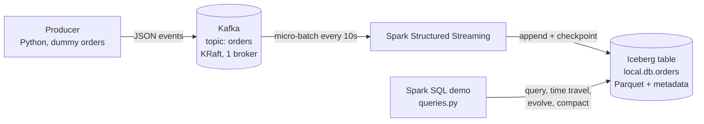
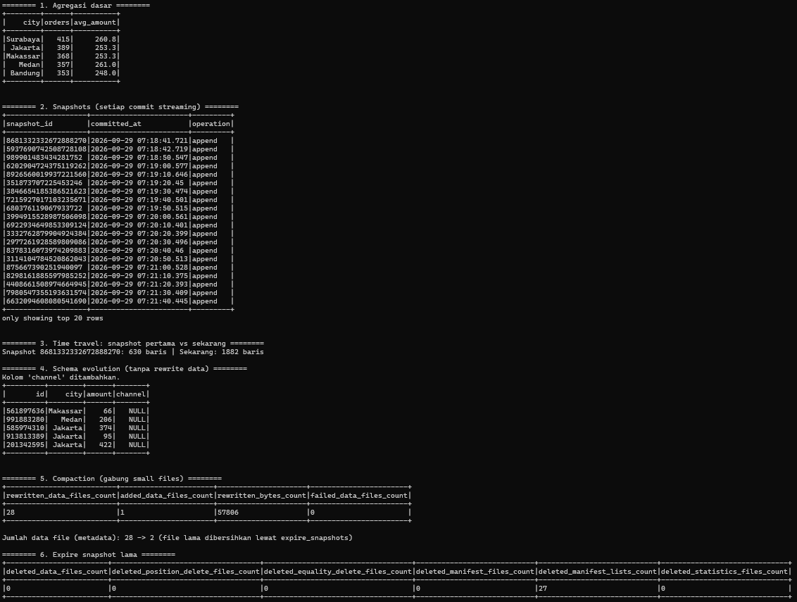

# Real-Time Order Pipeline: Kafka → Spark Structured Streaming → Apache Iceberg

A small, fully containerized lakehouse pipeline that runs on a laptop with a single command.
It streams dummy order events into Kafka, lands them in an Apache Iceberg table with Spark
Structured Streaming, and demonstrates the table-format features that matter in production:
snapshots, time travel, schema evolution, compaction, and snapshot expiration.

> Built as a hands-on lab to explore the open-source data stack behind platforms such as
> Cloudera Data Platform (CDP).

## Architecture



| Component | Version | Role |
|---|---|---|
| Apache Kafka | 3.7.0 (KRaft, no ZooKeeper) | Durable event buffer |
| Apache Spark | 3.5.1 | Streaming ingestion and maintenance jobs |
| Apache Iceberg | 1.5.2 (Hadoop catalog) | Open table format on Parquet |
| Docker Compose | v2 | Reproducible local environment |

## Quick start

**Requirements:** Docker with Compose v2, about 6-8 GB free RAM, internet access on first run
(images and Spark packages are downloaded).

```bash
docker compose up -d --build                      # start Kafka, producer, streaming job
docker compose logs -f streaming                  # watch the stream (Ctrl+C to detach)
docker compose --profile tools run --rm query     # run the Iceberg demo
docker compose down                               # stop (data stays in ./warehouse)
```

Wait 1-2 minutes after startup so several snapshots exist before running the demo.
On Linux/macOS you can use the `Makefile` shortcuts (`make up`, `make query`, `make down`, `make clean`).
To wipe all data: `docker compose down -v`, then delete `warehouse/` and `checkpoints/`.

Verify events are flowing:

```bash
docker exec kafka /opt/kafka/bin/kafka-get-offsets.sh --bootstrap-server localhost:9092 --topic orders
```

## What the demo shows, and what I observed

The results below come from a real run of `spark/queries.py`.

### 1. Consistency end to end
Orders per city summed to **1,882**, exactly matching the table row count. No events were lost
or duplicated between Kafka and Iceberg.

### 2. One snapshot per micro-batch
Snapshots were committed roughly every 10 seconds (`append` operations), matching the
`processingTime` trigger. Every commit is an atomic, queryable version of the table.

### 3. Time travel
The first snapshot already contained **630 rows**, versus 1,882 at query time. The producer
started before Spark was ready, so the first micro-batch consumed the Kafka backlog
(`startingOffsets = earliest`), which is a nice illustration of Kafka buffering data while a consumer is down.

```sql
SELECT count(*) FROM local.db.orders VERSION AS OF <snapshot_id>;
```

### 4. Schema evolution without rewriting data
```sql
ALTER TABLE local.db.orders ADD COLUMN channel STRING;
```
Existing rows return `NULL` for the new column. Only metadata changed; no data files were rewritten.

### 5. Compaction of small files
Streaming produced many tiny files. `rewrite_data_files` merged **28 small files into 1**
(about 57 KB) with **0 failures**, while the stream kept running, which shows Iceberg's optimistic
concurrency at work.

```sql
CALL local.system.rewrite_data_files(table => 'db.orders');
```

### 6. Snapshot expiration
`expire_snapshots` removed **27 old manifest lists** and kept the last 3 snapshots. No data files
were deleted yet because the retained snapshots still referenced the pre-compaction files.
Those files become removable once the snapshots referencing them expire, which is why maintenance
needs to run on a schedule, not just once.



## Key takeaways

- **Small files are the price of streaming.** Frequent commits create many small files; compaction is routine maintenance, not an optimization to do later.
- **Snapshots give auditability.** Time travel and rollback come from table metadata, not from copying data.
- **Schema changes are metadata operations.** Adding a column does not touch existing data.
- **Retention is a trade-off.** The demo expires aggressively (`retain_last => 3`). In production, use time-based retention (for example 7 days) to balance audit needs against storage cost.

## Mapping to an enterprise platform (Cloudera CDP)

| This lab | Enterprise equivalent |
|---|---|
| Python producer | NiFi / Cloudera DataFlow for ingestion |
| Kafka container | Streams Messaging (Kafka) |
| Spark in Docker | CDP Data Engineering (Spark on Kubernetes) |
| Hadoop catalog | Hive Metastore / shared catalog via SDX |
| Iceberg via Spark | Iceberg tables shared across engines (Spark, Impala, Hive) |
| Not covered | Ranger (access control), Atlas (lineage and governance), scheduled maintenance |

## Repository structure

```
.
├── docker-compose.yml     # Kafka, topic init, producer, streaming job, query job
├── producer/
│   ├── Dockerfile
│   └── producer.py        # dummy order generator (city, amount, timestamp)
├── spark/
│   ├── stream.py          # Kafka → Iceberg, checkpointed, 10s trigger
│   └── queries.py         # Iceberg feature demo
├── docs/screenshots/      # your run output
├── Makefile
└── README.md
```

## Troubleshooting

| Symptom | Fix |
|---|---|
| `docker` not recognized | Install Docker Desktop, reopen the terminal |
| "Virtualization support not detected" | Enable *Virtual Machine Platform* and WSL, run `wsl --update`, restart |
| Streaming logs quiet for 1-3 min on first run | Spark is downloading Kafka/Iceberg JARs; wait |
| Query shows empty or few rows | Wait 1-2 minutes after startup and rerun |
| Port 9092 already in use | Stop the other Kafka or change the port mapping |
| Laptop slow or containers killed | Free RAM, cap WSL memory in `.wslconfig`, or `docker compose stop producer` |

## Ideas for extension

- Replace the Hadoop catalog with a REST catalog or Hive Metastore, and store data on MinIO (S3)
- Add Trino or Impala to query the same table from a second engine
- Partition by `days(ts)` and compare query performance
- Schedule compaction and snapshot expiration with Airflow
- Add data quality checks and a dead-letter topic for malformed events

## License

MIT (or your preferred license).
